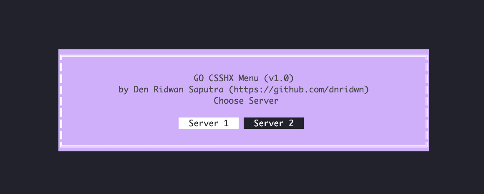
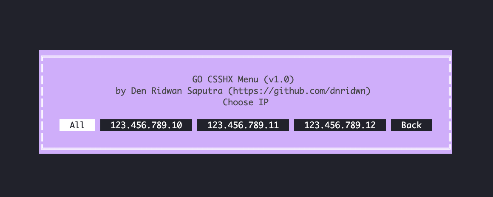

# GO CSSHX MENU (Mac only)

binary file to make it easier for you to choose which server you want to open ssh cluster with csshx (made because sometimes i am too lazy to write all the server IPs LOL😂)

## Prerequisite
- CSSHX installed on your Mac

## Environment Variables

To run, you will need to add the following environment variables to your .env file

`CSSHX_SERVER_CONF_FILE_PATH`


## Installation

- Download binary file from [Release](https://github.com/dnridwn/go-csshx-menu/releases)
- [Setup CSSHX Server List Configuration](#fill-csshx-server-list-configuration)
- [Set Configuration File Path Environment Variables](#set-configuration-file-path-environment-variables)
- [Set Binary File as Executable](#set-binary-file-as-executable)
- [Run the binary file](#run-the-binary-file)
## Documentation

#### Fill CSSHX Server List Configuration
Example:
```yaml
ssh_servers:
  - name: "Server 1"
    user: "root"
    ips:
      - "123.456.789.10"
      - "123.456.789.11"
      - "123.456.789.12"
  - name: "Server 2"
    user: "root"
    ips:
      - "123.456.789.10"
      - "123.456.789.11"
      - "123.456.789.12"
```
Then save as YAML file (example: conf.yml)

#### Set Configuration File Path Environment Variables
```bash
export CSSHX_SERVER_CONF_FILE_PATH="/path/to/your/csshx/server/list/conf/file.yml"
```

#### Set Binary File as Executable
```bash
chmod +x go-csshx-menu
```

#### Run the Binary File
```bash
./go-csshx-menu
```
## Screenshots





## Acknowledgements

 - [CSSHX](https://github.com/brockgr/csshx)

